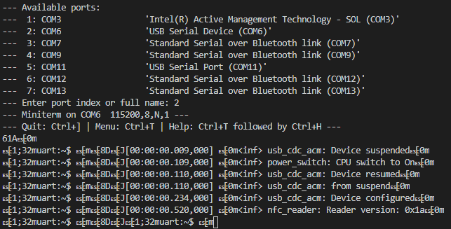

# Getting Started

Dragon Test Framework provide scripts and additional libraries to control equipment, automate tests and analytics.

*For instance: accessing a serial terminal, interacting with chamber, plot graphs ...*

## Setup The Environment

1. Install [Anaconda on Windows](https://docs.anaconda.com/anaconda/install/windows/).
2. Install the package [pySerial](https://pyserial.readthedocs.io/en/latest/pyserial.html#installation).

## Examples

> \>python miniterm.py

## Some Guidelines

The [official Python3 guidelines](https://www.python.org/dev/peps/pep-0008/) are taken as reference.

Main points:

- Function names should be lowercase, with words separated by underscores as necessary to improve readability.
- Class names should normally use the CapWords convention, "*ClassName*"
- Please use exceptions instead of return code to exit a function in case of errors
